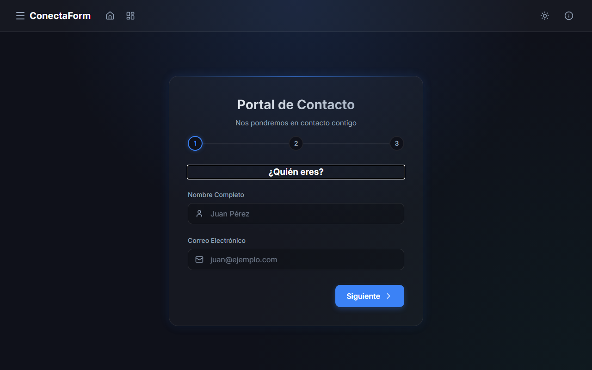
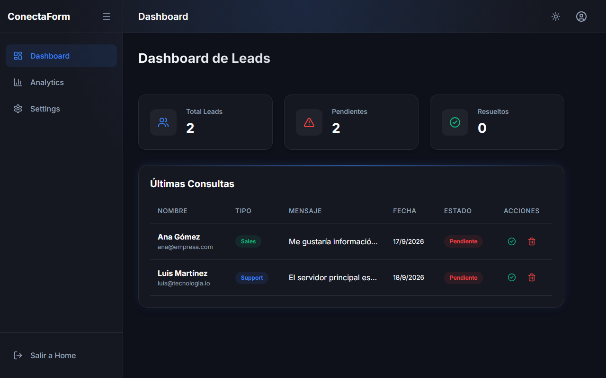
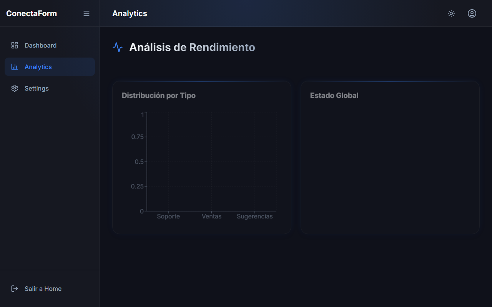
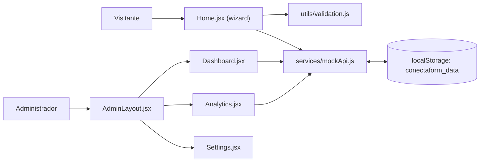

<div align="center">
  
  <h1>ConectaForm</h1>
  <p><b>Formulario de contacto en 3 pasos con validación real y un panel de administración de demostración para revisar los mensajes.</b></p>
  
  
  
  
  <a href="https://github.com/Luiss2080/ConectaForm/actions/workflows/ci.yml"></a>
  <p>
    <a href="#-inicio-rápido">Inicio rápido</a> ·
    <a href="#-características">Características</a> ·
    <a href="#-arquitectura">Arquitectura</a> ·
    <a href="#-pruebas">Pruebas</a> ·
    <a href="#-lo-que-todavía-no-existe">Limitaciones</a>
  </p>
</div>

ConectaForm es una SPA de React + Vite que captura un mensaje de contacto en
3 pasos y le da a quien administra un lugar donde verlos, marcarlos como
resueltos y ver métricas. **No tiene backend**: los datos viven en el
`localStorage` del navegador (`src/services/mockApi.js`), así que sirve como
demo o como base para conectar una API real, no como formulario de producción.

## 🎬 Vista rápida

| Formulario público (`/`) | Dashboard (`/admin/dashboard`) | Analytics (`/admin/analytics`) |
|---|---|---|
|  |  |  |

> Las consultas de la tabla son datos ficticios que la propia app siembra la primera vez que se abre.

## ✨ Características

| Característica | Detalle |
|---|---|
| Wizard de 3 pasos | Identidad → motivo de contacto → mensaje y confirmación, con barra de progreso. El paso 1 no deja avanzar con nombre vacío o email inválido; el envío final revalida todo. |
| Validación en cliente | `src/utils/validation.js`: nombre obligatorio, email con formato, mensaje de 10 a 500 caracteres y checkbox de términos obligatorio. Errores junto a cada campo. |
| Modal reutilizable | `Modal.jsx` para términos e información; cierra con clic fuera o `Escape` y atrapa el foco con Tab. |
| Toasts | Avisos de éxito/error que se cierran solos. |
| Tema claro/oscuro | Botón de alternancia; es estado de React, **no se persiste** (vuelve a oscuro al recargar). |
| Dashboard de leads | Tarjetas de totales y tabla de consultas con acciones para resolver o eliminar. |
| Analytics | Gráfico de barras (consultas por tipo) y de dona (pendientes vs. resueltas) con `recharts`. |
| Settings | Panel de ejemplo con un switch de notificaciones que no tiene efecto real. |

## 🏗️ Arquitectura



Rutas (`src/App.jsx`, React Router 7): `/` pública; `/admin/dashboard`,
`/admin/analytics` y `/admin/settings` para el panel; `/dashboard` y
cualquier ruta desconocida redirigen.

## 🚀 Inicio rápido

| Requisito | Versión |
|---|---|
| Node.js | 22 (el que usa el CI) |
| npm | el que incluye Node |

1. Instala dependencias:
   ```bash
   npm ci
   ```
2. Levanta el servidor de desarrollo (http://localhost:5173):
   ```bash
   npm run dev
   ```
3. Envía un mensaje en `/` y míralo en `/admin/dashboard` **en el mismo navegador**.

Otros comandos: `npm run build` (genera `dist/`), `npm run preview`, `npm run lint` (oxlint), `npm test`.

<details>
<summary>Estructura de carpetas</summary>

```text
src/
├── components/   Layout, Modal, Toast
├── layouts/      AdminLayout (sidebar + topbar)
├── pages/        Home, Dashboard, Analytics, Settings
├── services/     mockApi.js (simula backend con localStorage)
├── utils/        validation.js
├── __tests__/    Form, Modal, Validation
└── App.jsx       rutas
```

Documentación adicional: [Manual de uso](./MANUAL_DE_USO.md).

</details>

## 🧪 Pruebas

```bash
npm test
```

31 tests con Vitest + React Testing Library + jsdom, repartidos en 3
archivos: validación, wizard del formulario y modal. El CI
(`.github/workflows/ci.yml`) ejecuta lint, tests y build.

## 🔒 Seguridad

- La validación existe solo en el cliente; no hay servidor que la repita.
- `/admin/*` **no tiene autenticación**: cualquiera con la URL lo ve.

## 🚧 Lo que todavía no existe

- Backend, base de datos y persistencia compartida entre dispositivos.
- Autenticación o roles para el panel de administración.
- Envío real de correos o notificaciones (el switch de Settings es solo visual).
- Persistencia del tema claro/oscuro.
- `npm run lint` termina con 3 avisos (import sin usar, `catch` sin usar y una referencia temprana en `Dashboard.jsx`), sin errores.

## 📄 Licencia

Sin licencia definida: todos los derechos reservados por defecto.

<div align="center"><sub>Hecho por Luiss2080 · React + Vite</sub></div>
